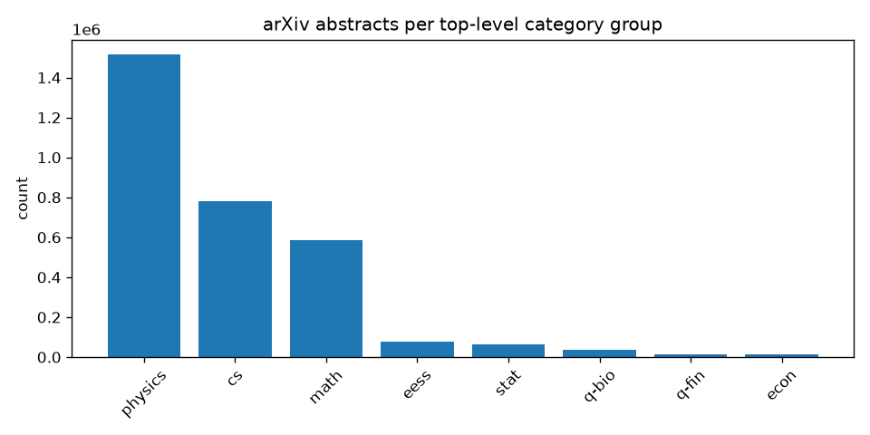
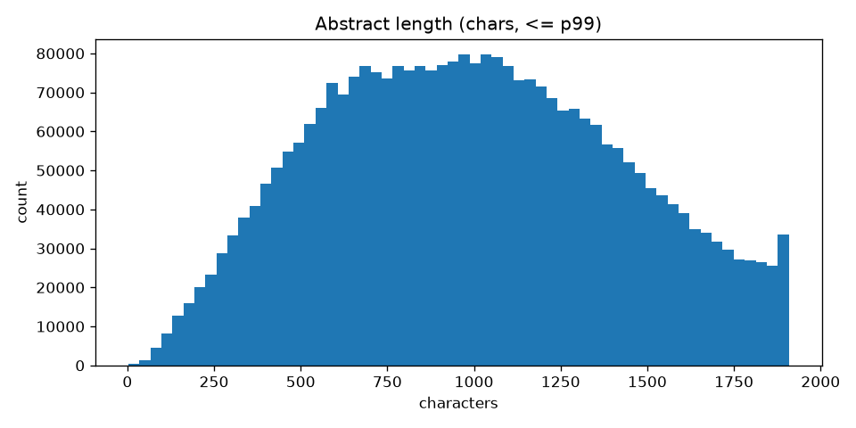
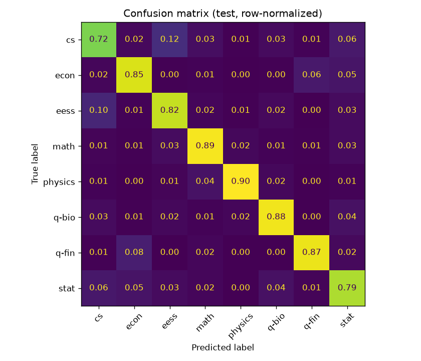

# abstract-classifier

A Django REST Framework API that classifies arXiv research-paper abstracts into
top-level category groups (`cs`, `math`, `physics`, `q-bio`, `q-fin`, `stat`,
`eess`, `econ`), backed by a swappable ML core.

The API is the deliverable; the model is loaded behind a clean contract so it can
be swapped (stub → TF-IDF → DistilBERT) by changing a single env var, with no
change to the web layer. See `docs/implementation-plan.md` for the full design and
`AGENTS.md` for the working agreement.

> **Status: Stage 2 (TF-IDF baseline).** The service runs end-to-end with a real
> classical model — TF-IDF + class-weighted LogisticRegression — selectable via
> `MODEL_BACKEND=tfidf`. The dependency-free `StubPredictor` remains the default for
> tests and cold scaffolding. DistilBERT lands in Stage 3 as a drop-in swap.

## Quick start

### Docker (recommended)

```bash
# Real TF-IDF model (committed under pretrained/tfidf, baked into the image):
MODEL_BACKEND=tfidf docker compose up --build
# omit MODEL_BACKEND to run the dependency-free stub instead.
# wait for /ready to return 200, then:
curl -s -X POST localhost:8000/api/v1/classify \
  -H 'Content-Type: application/json' \
  -d '{"abstract":"We present a transformer-based approach to graph learning."}'
```

### Local (uv)

```bash
make install          # uv sync
make run              # dev server (autoreload) on :8000
# or: make serve      # gunicorn (production server)
make test             # pytest
```

## API

| Method | Path                 | Description                                         |
|--------|----------------------|-----------------------------------------------------|
| POST   | `/api/v1/classify`   | Classify an abstract into a category group          |
| GET    | `/health`            | Liveness — always `200` while the process is up     |
| GET    | `/ready`             | Readiness — `200` once the model is loaded + warmed; `503` otherwise |

**`POST /api/v1/classify`**

```json
{ "abstract": "We present a transformer-based approach to..." }
```

```json
{
  "predicted_category": "cs",
  "confidence": 0.87,
  "top_k": [
    { "category": "cs",   "confidence": 0.87 },
    { "category": "stat", "confidence": 0.09 },
    { "category": "math", "confidence": 0.03 }
  ],
  "model_version": "stub-v1"
}
```

Validation errors return `400` with a consistent envelope (no stack traces leak):

```json
{ "error": { "code": "validation_error", "message": "Request validation failed.", "details": { "abstract": ["..."] } } }
```

## Configuration

Environment variables, parsed once into a framework-agnostic `InferenceConfig`:

| Variable             | Default     | Meaning                                            |
|----------------------|-------------|----------------------------------------------------|
| `MODEL_BACKEND`      | `stub`         | `stub` \| `tfidf` \| `distilbert`                  |
| `MODEL_SOURCE`       | `local`        | Artifact source (`local` now; `hf`/`s3` later)     |
| `MODEL_PATH`         | per-backend    | Local artifact dir; defaults to the backend's path (`tfidf` → committed `pretrained/tfidf`) |
| `MODEL_VERSION`      | per-backend    | Reported in responses; defaults to the backend's version (e.g. `tfidf-arxiv-v1`) |
| `INFERENCE_DEVICE`   | `cpu`          | `cpu` \| `cuda` \| `auto` (CPU is the prod default)|
| `MAX_ABSTRACT_CHARS` | `20000`        | Reject inputs longer than this                     |
| `WEB_CONCURRENCY`    | `2`            | Gunicorn sync workers (each loads its own model)   |

`MODEL_PATH` and `MODEL_VERSION` derive from `MODEL_BACKEND`, so selecting a
backend is a single env var — `MODEL_BACKEND=tfidf` loads the committed
`pretrained/tfidf/` artifact without any further configuration or a training step.
Override the path/version only to point at a non-standard artifact, e.g. a freshly
retrained `MODEL_PATH=artifacts/tfidf`. Locally: `MODEL_BACKEND=tfidf make run`.

The ~5 MB TF-IDF artifact is committed under `pretrained/tfidf/` (the one model
exception to "artifacts are never committed") so the API runs out of the box and
bakes into the Docker image. To refresh it after retraining: `make train-baseline
&& make promote-model`.

## Dataset & model

> _Numbers, tables, and plots in this section are generated by the `training/`
> pipeline (`make eda` / `make train-baseline`). Keep them in sync when the data or
> model changes — see the note in `AGENTS.md`._

### Data

Source: the Kaggle [`Cornell-University/arxiv`](https://www.kaggle.com/datasets/Cornell-University/arxiv)
metadata snapshot (~2.5M records). We use two fields: `abstract` (input) and
`categories` (label). The primary (first-listed) category is mapped to its
top-level arXiv **group**; the physics family (`astro-ph`, `cond-mat`, `hep-*`,
`quant-ph`, …) is collapsed into a single `physics` bucket.

> **Why these labels?** arXiv's taxonomy doesn't map cleanly to "biology / chemistry /
> social sciences", so we classify into arXiv's own top-level groups instead.
> Papers are inherently **multi-label** (we use the primary category for this
> single-label v1).

The raw distribution is **heavily imbalanced** (~126:1 between the largest and
smallest group), so we take a **capped stratified subsample** (per-class cap of
20,000 → ~145k rows, worst-case ratio ~1.7:1) and add class weights in the loss.

| group | raw count | share |
|---|---:|---:|
| physics | 1,514,553 | 49.1% |
| cs | 779,428 | 25.3% |
| math | 586,416 | 19.0% |
| eess | 79,285 | 2.6% |
| stat | 63,295 | 2.1% |
| q-bio | 34,487 | 1.1% |
| q-fin | 13,292 | 0.4% |
| econ | 12,025 | 0.4% |

<p align="center">
  
  
</p>

Abstracts are short — median ≈ 986 chars / 143 words, p99 ≈ 1,908 chars / 287 words —
which suits TF-IDF and keeps DistilBERT's 256-token truncation (Stage 3) lossless for
~90%+ of inputs.

### Baseline model — `tfidf-arxiv-v1`

TF-IDF (1–2 grams, `min_df=5`, 50k features, sublinear TF) over classical
preprocessing (lowercase → strip non-alpha → English stopwords → Porter stem),
feeding a class-weighted LogisticRegression. The preprocessor is shared between
training and serving (`arxiv_ml/predictors/text.py`) so there is no train/inference
drift. We report **macro** metrics (each class weighted equally) because accuracy
flatters the imbalanced majority groups.

**Held-out test set (14,532 rows):**

| metric | score |
|---|---:|
| accuracy | **0.838** |
| macro precision | 0.837 |
| macro recall | 0.840 |
| macro F1 | **0.838** |

<details>
<summary>Per-class breakdown</summary>

| group | precision | recall | F1 | support |
|---|---:|---:|---:|---:|
| cs | 0.766 | 0.721 | 0.743 | 2,000 |
| econ | 0.776 | 0.847 | 0.810 | 1,203 |
| eess | 0.794 | 0.821 | 0.807 | 2,000 |
| math | 0.867 | 0.887 | 0.877 | 2,000 |
| physics | 0.942 | 0.899 | 0.920 | 2,000 |
| q-bio | 0.876 | 0.879 | 0.878 | 2,000 |
| q-fin | 0.891 | 0.874 | 0.882 | 1,329 |
| stat | 0.787 | 0.789 | 0.788 | 2,000 |

</details>

<p align="center">
  
</p>

The confusion matrix shows the expected near-neighbor blur (`cs` ↔ `stat`/`eess`),
while distinct domains like `physics` separate cleanly.

### Reproducing

```bash
make dataset          # download the snapshot (needs Kaggle creds, see below)
make eda              # class distribution + length percentiles → artifacts/eda/
make prepare-data     # capped stratified subsample + train/val/test → data/prepared/
make train-baseline   # fit + evaluate → artifacts/tfidf/ and artifacts/metrics/
```

`make dataset` needs a one-time Kaggle API token at `~/.kaggle/kaggle.json`
(Kaggle → Account → *Create New Token*) and accepting the dataset terms once. The
dataset and trained artifacts are **gitignored** and never committed.

## Design notes

- **Architecture.** `arxiv_ml/` is a standalone, framework-agnostic ML core (no
  Django/DRF imports) defining the `Predictor` contract; `classifier/` is a thin
  DRF adapter over it; `training/` (later stages) produces artifacts. Dependency
  direction is one-way — both depend on `arxiv_ml`, which depends on neither — so
  the web framework or the ML core can each be swapped/extracted independently.
- **Model lifecycle.** The predictor is built once at startup in `AppConfig.ready()`,
  warmed with one inference, and held as a process-wide singleton. `/ready` only
  flips to `200` after that warm-up, so traffic is never routed to a cold model.
- **Observability.** Structured JSON logging from the start: a request-ID filter
  (honoring an inbound `X-Request-ID`) plus per-request inference latency; full
  exceptions are logged server-side only.
- **Concurrency.** Inference is CPU-bound and PyTorch only partially releases the
  GIL, so we scale with a small number of sync gunicorn workers — see the tradeoff
  comment in `gunicorn.conf.py`.

## Roadmap

Stage 2 (TF-IDF baseline) is complete. Stage 3 adds the fine-tuned DistilBERT model,
a drop-in swap via the `MODEL_BACKEND` env var. Phase 2 polish (OpenAPI/Swagger,
`/api/v1` versioning, throttling) follows. Phases 3–4 (Prometheus, auth, CI, a
dedicated inference server / model registry / GPU serving image) are scoped in
`docs/implementation-plan.md`.
